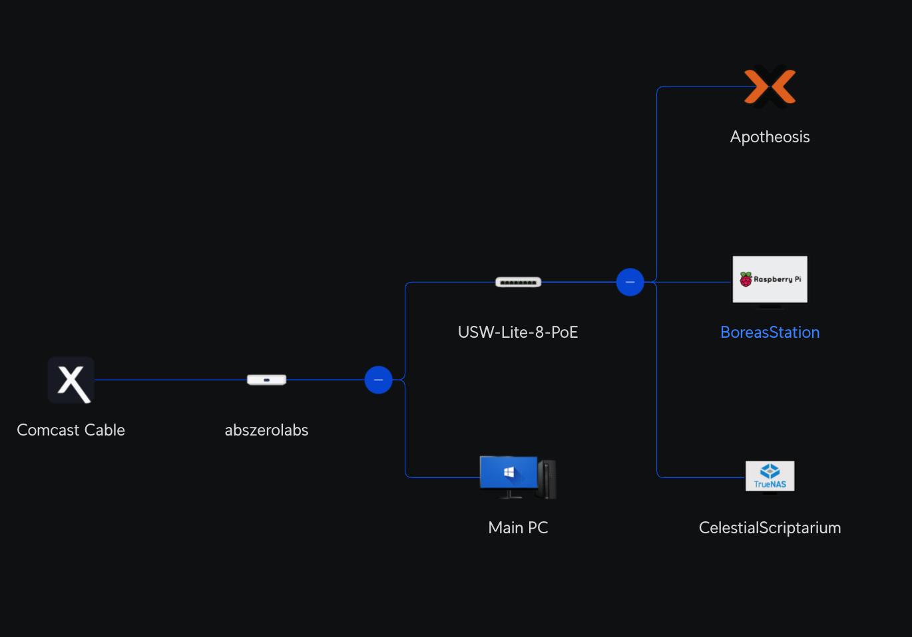

# abszerolabs
## My Homelab

Welcome to my homelab! This is my sandbox for **computers**, **networking**, and **cybersecurity**. I use it to learn, experiment, and build projects related to my Master’s program, as well as to run fun self-hosted apps and services.

> I use this lab as part of my Master’s in Cybersecurity and Privacy program and for hands-on projects in malware analysis, network defense, and infrastructure automation.

---

## Table of Contents
- [Architecture](#architecture)
- [Core Technologies](#core-technologies)
- [Services](#services)
- [Projects](#projects)
- [Real World Applications](#real-world-applications)
- [Lessons and Skills Learned](#lessons-and-skills-learned)
- [Hardware](#hardware)

---

## Architecture

### Servers
| Name | Hardware | OS |  Application |
|------|----------|----|--------------|
| [Apotheosis](docs/Apotheosis.md) | Beelink Mini PC | Proxmox | Main server for projects and learning |
| [BoreasStation](docs/BoreasStation.md) | Raspberry Pi 5 | Raspberry Pi OS | For fun, experimenting and SDR applications |
| [CelestialScriptarium](docs/CelestialScriptarium.md) | Dell Optiplex 3080 | TrueNAS Scale | Media server and NAS |
| [DemiurgeCore](docs/DemiurgeCore.md) | Dell Precision Tower 7420 | Proxmox | AI server, currently in development, not deployed |

### Networking Hardware
- Ubiquiti Ultra Cloud Gateway
- Ubiquiti 8-port PoE Switch
- (Planned) Ubiquiti WiFi Router

## Core Technologies

Virtualization

Using Proxmox to manage and run VM's and LXC containers

Storage

TrueNAS Scale (dedicated), 2TB Pi drive for quick storage

Containers & Apps

Docker + CasaOS on the Pi, LXC Containers on Proxmox

Remote Access

Twingate (LXC container) + Backup Twingate connector on Pi, Ubiquiti VPN for direct access

Networking

Managed through the Ubiquiti Ultra Cloud Gateway (firewall, VPN, VLANs, monitoring)

Security

SIEM, vulnerability scanners, IDS/IPS

Operating Systems

I use Ubuntu Server for VMs unless required otherwise

Databases

Self-hosted DB in Proxmox LXC for various projects

Special Hardware

SDR dongle for radio experiments

## Services
| Category       | Services                  |
|----------------|------------------------|
| Infrastructure & Management | CasaOS, Portainer, Dashy, Ubiquiti apps, Twingate, ProtonVPN, Gluetun        |
| Media     | Jellyfin, Radarr, Sonarr, qBittorrent |
| Automation & AI       | n8n, Ollama, Open WebUI for Ollama |
| Security | Pi-hole, Wazuh, Suricata, OpenVAS |
| Web & Monitoring | Nginx, Grafana, Prometheus |
| Other Experiments | (various apps for testing/learning) |

## Projects
- Malware Analysis: Static & dynamic analysis on Windows VM for my Master’s program
- Detection & Pen Testing Lab: SIEM, IDS/IPS, scanners, red/blue team experiments
- Logging & Monitoring: Centralized dashboards & alerts

  
## Real World Applications
- AI Server – n8n + Ollama workflows
- Media Streaming – Jellyfin setup
- Cloud Storage – Personal data + backups
- Dashboards – Network/service visibility
- Sandbox – General skill-building and experiments

  
## Lessons and Skills Learned
- Networking & Security – firewall, VPN, VLANs, SIEM, IDS/IPS, vulnerability scanning
- Systems Administration – virtualization, container orchestration, storage management
- Automation & Scripting – workflow automation, infrastructure management
- Monitoring & Troubleshooting – log collection, dashboards, alerting
- Trade-offs between VMs, LXC containers, and Docker in resource usage
